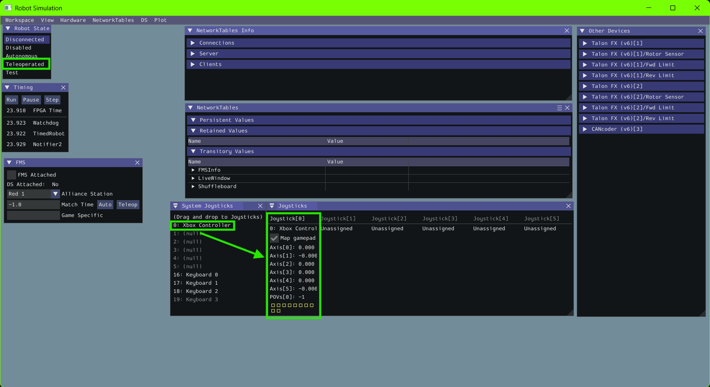
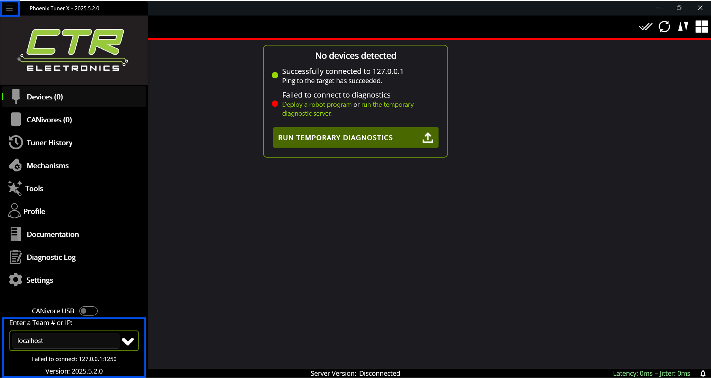
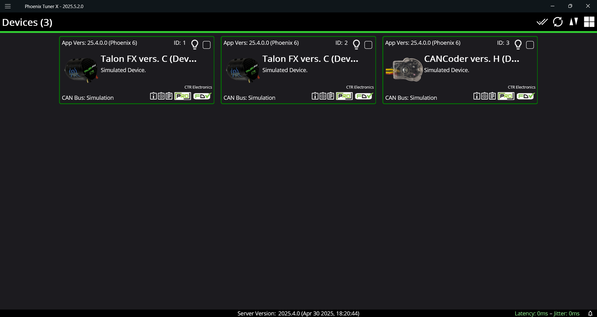
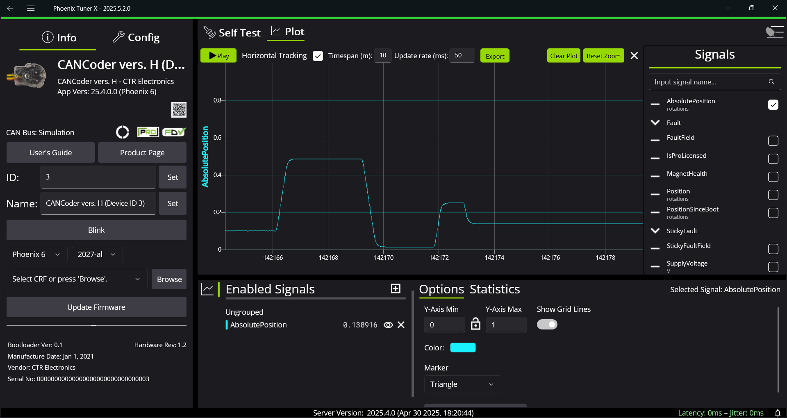

# Team 4265 - Command Structure Examples

## Overview

This FRC robot project is structured using the **Command-Based framework** recommended by WPILib. It is designed to be modular, readable, and easily extensible for both teleoperated and autonomous modes. The robot currently includes two core mechanisms: an `intake` and a `pivot`.

- The **IntakeSubsystem** controls a single motor used to collect or eject game pieces.
  - TalonFX Motor (Kraken X60 Kraken X44, Falcon 500)
  - Improvement Opportunities: integrating a beam break or some other sensor in the simulation
  - Note: simulation values (for the motor and encoder) can been seen in the **Phoenix Tuner X** application

- The **PivotSubsystem** drives a pivoting arm using a motor and an `absolute encoder` for precise angular positioning. The pivot uses `Motion Magic` for smooth motion profiling, and supports software-defined soft limits to prevent over-rotation.
  - TalonFX Motor (Kraken X60, Kraken X44, Falcon 500)
  - Cancoder
  - Note: simulation values (for the motor and encoder) can been seen in the **Phoenix Tuner X** application

- The **Pivot2Subsystem** drives a pivoting arm using a motor and an `absolute encoder` for precise angular positioning. The pivot uses a `PID Controller` for smooth motion profiling, and supports software-defined soft limits to prevent over-rotation.
  - TalonFX Motor (Kraken X60, Kraken X44, Falcon 500)
  - Rev Throughbore absolute encoder (connected to the RoboRIO)
  - Note: simulation values (for the motor) can been seen in the **Phoenix Tuner X** application and the simulation values (for the encoder) can be seen in the **WPILib Sim GUI**

The project includes example commands to operate both mechanisms:

- Commands to run the intake / pivot motors at fixed speeds.
- A specific command that moves the pivot to a user defined angle using Motion Magic and finishes when within a configurable error tolerance.

All control bindings are defined in `RobotContainer`, using the `onTrue()` and `whileTrue()` trigger methods to map controller inputs to subsystem behaviors. This project follows the standard directory and class layout defined by FIRST and WPILib for command-based robots.

Additionally, **simulation** support has been implemented for both the intake and pivot subsystems. This allows for hardware-free testing of motor behavior and sensor feedback within WPILib’s simulation framework, which can be run via VS Code or other simulation tools.

This codebase serves as a clean and practical example of a command-based robot architecture, complete with real-time control, encoder feedback, and simulation support.

<details>
  <summary>📁 <strong>Code Structure</strong> (Click to expand)</summary>

#### 📄 **Key Files**

##### `Main.java`

* **Purpose**: Entry point for the program.
* **Details**: Contains the `main()` method that starts the robot using WPILib’s `RobotBase.startRobot()`. You typically won’t need to modify this.

##### `Robot.java`

* **Purpose**: Controls the robot's mode transitions and periodic updates.
* **Details**: Defines methods like `robotInit()`, `teleopPeriodic()`, and `autonomousInit()`. Delegates actual logic to `RobotContainer` and the CommandScheduler.

##### `RobotContainer.java`

* **Purpose**: Central wiring for your robot’s components.
* **Details**: Instantiates subsystems, commands, and controller bindings. Returns the autonomous command during auto mode. Keeps setup code organized and separate from runtime logic.

---

#### 📁 **Key Folders**

##### `/actors/subsystems`

* **Purpose**: Encapsulates control of specific robot mechanisms.
* **Details**: Each subsystem class (e.g. `Intake`, `Pivot`) manages motors, encoders, and control logic for one part of the robot. Exposes public methods used by commands (like `acquireCoral()` or `moveToPosition(double degrees)`).

##### `/commands`

* **Purpose**: Defines robot behaviors using subsystems.
* **Details**: Each command implements a task or behavior (e.g. `PivotToPositionCommand`). Commands use `initialize()`, `execute()`, `end()`, and `isFinished()` to control the robot in response to driver input or autonomous instructions.

##### `/utils`

* **Purpose**: Stores shared utility classes and helper functions.
* **Details**: May include math helpers, logging utilities, custom PID wrappers, or unit converters. Keeps common logic centralized and reusable across subsystems and commands.

</details>

## 🧑‍💻 Simulation

This project supports **full robot simulation** using the WPILib **Sim GUI** and **CTRE’s Phoenix Tuner X**. You can run your robot code, simulate motors and sensors (like **Kraken X** and **CANcoder**), and visualize your robot in real time — all without a RoboRIO.

#### 🧰 Requirements

| Tool / Library                                                        | Purpose                                              |
| --------------------------------------------------------------------- | ---------------------------------------------------- |
| [WPILib for VS Code](https://docs.wpilib.org/en/stable/docs/zero-to-robot/step-2/wpilib-setup.html#wpilib-installation-guide)                         | Runs your Java robot code with simulation support    |
| [Phoenix Tuner X](https://v6.docs.ctr-electronics.com/en/stable/docs/tuner/index.html) | Simulates CTRE CAN devices over CAN bus              |
| XBox Controller with USB connection | Used to interact with the simulation and trigger commands              |

#### ▶️ Launch from VS Code:

1. Open your project in **VS Code**

2. Press `Ctrl+Shift+P`

3. Type and select:

   ```
   WPILib: Simulate Robot Code
   ```

4. Select `SIM GUI` checkbox selection

5. This launches the **WPILib Sim GUI**, which gives you:

   * **Joystick support** (if a USB controller is connected)
   * **Real-time robot output logs**
   * Access to **NetworkTables** values (e.g., encoder positions, subsystem states)

6. At this point, your Java code is running exactly as it would on a RoboRIO.
7. You need to make sure you select `Teleoperated` and move your controller into slot 0. 

>> 

#### ▶️ Launch Phoenix Tuner X:

1. Open the **Phoenix Tuner X** application

2. Select the `hamburger` icon on the top left and select `localhost` at the bottom of the menu

>> 

3. With your simulation running, you should see the simluated devices like so:

>> 

3. Now you can select a device, execute commands and see the simulated action performed on the graph:

>> 

#### 🎮 Scenarios to Test:

The following controls will control the intake (Motor ID 1):
   - Controller Right Trigger - Coral Intake
   - Controller Left Trigger - Coral Release
   - Controller Right Bumper - Algae Intake
   - Controller Left Bumper - Algae Release

   >> Note: These commands only run while the button is pressed / activated. When the button is released,
   the command will stop running

The following controls will control the pivot (Motor ID 2, Encoder ID 3):
   - Controller Y Button - Pivot Forward
   - Controller A Button - Pivot Backward

   >> Note: These commands only run while the button is pressed / activated. When the button is released,
   the command will stop running

   - Controller B Button - Pivot To Position (50 deg)
   - Controller X Button - Pivot To Position (90 deg)
   - Controller D-Pad Up - Pivot To Position (175 deg)
   - Controller D-Pad Down - Pivot To Position (5 deg)

   >> Note: These commands will run (and stay running) when the button is pressed / activated until a condition is met.

The following controls will control the pivot (Motor ID 4, Encoder Channel ID 0 (On the RIO)): 
   - Controller D-Pad Left - Pivot2 To Position (50 deg)
   - Controller D-Pad Right - Pivo2 To Position (90 deg)

   >> Note: These commands will run (and stay running) when the button is pressed / activated until a condition is met.